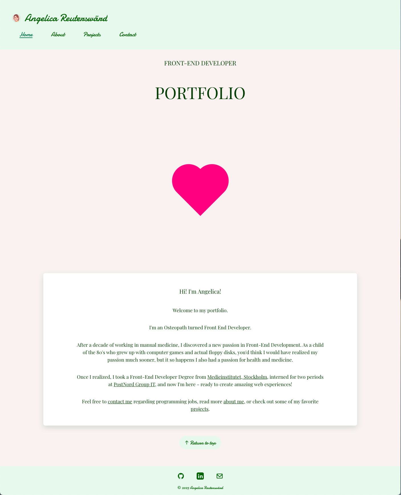

# 🎨 Angie’s Portfolio – Front-End Developer

Welcome to the source code for [Angie’s Portfolio](https://ayngie.github.io/react-portfolio/), a modern, accessible, and responsive portfolio website built with **React**, **TypeScript**, **Vite**, and **Scss**.

---

## 🌟 Project Preview



*Screenshot: The homepage of Angie’s Portfolio, showing the main introduction card, navigation, and a modern, accessible layout.*

---

## 👩‍💻 About

This project showcases the skills, projects, and background of **Ayngie**, an osteopath-turned-front-end developer with a passion for creating beautiful, accessible, and performant web experiences.

---

## ✨ Features

- **⚡ Modern Stack:** React 19, TypeScript, Vite for fast development and optimal performance.
- **📱 Responsive Design:** Seamless experience on all devices using Flexbox, CSS Grid, and custom SCSS.
- **♿ Accessibility:** Keyboard-friendly navigation, semantic markup, and ARIA labels following WCAG guidelines.
- **🧩 Component Architecture:** Reusable, well-structured React components for maintainability and scalability.
- **🎨 Custom Styling:** Modular SCSS for clean, maintainable styles.
- **🔗 Dynamic GitHub Integration:** Displays selected GitHub repositories with custom info and live links.
- **📬 Contact Form:** Accessible form with validation and email sending via EmailJS.
- **🧹 Code Quality:** ESLint integration with strict rules for consistent, high-quality code.
- **🔍 SEO Optimized:** Meta tags for search engines and social media sharing (Open Graph, Twitter Cards).

---

## 🛠️ Techniques & Tools

- **React 19** (functional components & hooks)
- **TypeScript** (type safety)
- **Vite** (fast builds & HMR)
- **SCSS** (responsive, modular styling)
- **EmailJS** (contact form integration)
- **GitHub API** (dynamic project listing)
- **ESLint** (code linting)
- **Accessible design** (WCAG guidelines)

---

## 🗂️ Project Structure

```
src/
  components/
  pages/
  services/
  styles/
  App.tsx
  main.tsx
  ...
```

---

## 📜 License

This project is licensed under the [MIT License](LICENSE).

---

**Made with ❤️ by Ayngie**
